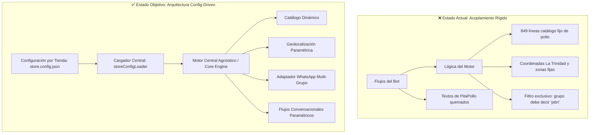
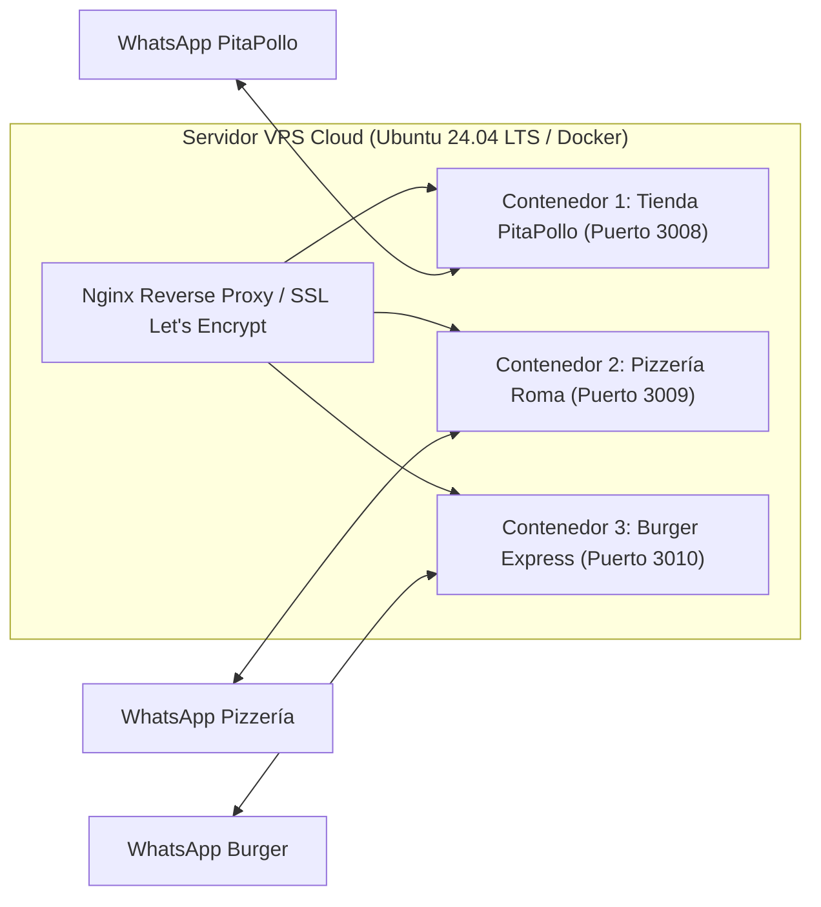

# 🚀 Plan de Reestructuración: Plataforma SaaS / Marca Blanca para Asistentes Comerciales de WhatsApp

---

## 1. Resumen Ejecutivo y Visión del Proyecto

### 1.1. De un Bot Específico a una Plataforma Multi-Tienda
El asistente actual nació y se optimizó para **PitaPollo (La Trinidad)**. Durante su desarrollo, se construyeron capacidades de alto nivel:
* Conexión robusta a WhatsApp mediante Baileys y BuilderBot.
* Procesamiento de pedidos en lenguaje natural venezolano (eliminación de muletillas, extracción de cantidades y cortes).
* Motor de cotización de delivery geográfico inteligente (cálculo de distancia GPS por fórmula Haversine y zonas fijas).
* Ciclo de vida completo del pedido sincronizado con grupos de WhatsApp del personal (aviso de pedido, pesaje/ticket, `#ok`, `#cambio`, `#listo`, `#camino`, `#cancelar`).
* Memoria de clientes para pedidos express en 1 solo paso.

**La Oportunidad:** Más del 85% de esta infraestructura es un **motor universal** aplicable a restaurantes, pizzerías, hamburgueserías, carnicerías, bodegones, licorerías o farmacias. La meta de esta reestructuración es **desacoplar el 15% restante** (textos quemados, catálogo estático y coordenadas fijas) para convertir el proyecto en un **producto Marca Blanca (White-Label)** que se pueda comercializar y desplegar a nuevos clientes en cuestión de minutos simplemente editando un archivo de configuración.

---

## 2. Diagnóstico Arquitectónico: Estado Actual vs. Objetivo



### 2.1. Matriz Detallada de Cambios

| Componente | Archivo(s) Actual(es) | Estado Actual (Acoplado a PitaPollo) | Estado Futuro (Marca Blanca / Config-Driven) |
| :--- | :--- | :--- | :--- |
| **Identidad & Marca** | `src/config/data.js`<br>`src/flows/welcome.flow.js`<br>`src/flows/info.flow.js` | Textos fijos de pollo fresco, emojis `🍗`, dirección de La Trinidad y referencia a Farmatodo. | 100% dinámico desde `config.business`: nombre, asistente, icono distintivo, eslogan, bienvenida y contacto. |
| **Catálogo de Precios** | `src/services/catalogSearchService.js` (849 líneas) | Definición estática de pechuga, filet, muslo, res, cerdo y queso quemada en código JS. | Motor de búsqueda dinámico que indexa el array `config.catalog.products`. Soporta precios, variantes, categorías y respuestas automáticas. |
| **Filtro de Grupos** | `src/services/baileysGroupAdapter.js` (Línea 69) | Ignora cualquier grupo de WhatsApp que no contenga la palabra `"pitin"` en el nombre. | Filtro parametrizado con `config.whatsapp.groupKeyword` (ej: `"napoli"`, `"burger"`). |
| **Delivery & Coordenadas** | `src/config/delivery.js` | Coordenadas de La Trinidad y zonas de Baruta/Hatillo fijas en código JS. | El motor Haversine se mantiene intacto; lee coordenadas y tarifas desde `config.delivery`. |
| **Métodos de Pago** | `src/config/data.js`<br>`src/flows/payment.flow.js` | Banesco y Zelle de PitaPollo definidos en variables fijas. | Carga los métodos activos definidos en `config.paymentMethods` (Pago Móvil, Zelle, Efectivo, POS). |
| **Parser de Pedidos** | `src/services/orderParser.js` | Palabras fijas de carnicería (`pechuga`, `muslo`, etc.) y el nombre `pitin` en muletillas. | Extrae el vocabulario de productos desde el catálogo activo y el nombre del asistente desde el config. |
| **Notificaciones & Comandas** | `src/services/orderService.js`<br>`src/flows/group.flow.js` | Dice *"pesará tu pedido y enviará el ticket"* y *"Gracias por preferir a PitaPollo"*. | Plantillas configurables por tipo de negocio (pesaje de carnicería vs. preparación de restaurante). |
| **Horarios de Atención** | `src/services/scheduleService.js` | Horarios fijos de Lunes a Sábado y Domingo en código JS. | Rangos de días y horas parametrizados en `config.schedule`. |

---

## 3. Especificación del Modelo `store.config.json`

Cada negocio o sucursal contará con un archivo JSON en su raíz que define su identidad y reglas de operación:

```json
{
  "$schema": "./schema/store.schema.json",
  "business": {
    "id": "pitapollo-trinidad",
    "name": "PitaPollo",
    "branch": "La Trinidad",
    "assistantName": "Pitín",
    "icon": "🍗",
    "tagline": "Pollo fresco de primera, combos y charcutería selecta",
    "welcomeMessage": "Estamos a la orden con pollo fresco de primera, combos y charcutería.\n¿Qué tienes en mente llevar hoy, o prefieres que te comparta la lista de precios en PDF para revisar con calma?",
    "phone": "0414-263-40-53",
    "instagram": "@pitapolloccs",
    "address": "Calle principal de La Trinidad, Caracas (Referencia: cerca del Farmatodo / zona comercial).",
    "location": {
      "latitude": 10.4326,
      "longitude": -66.8601
    }
  },
  "whatsapp": {
    "groupKeyword": "pitin"
  },
  "schedule": {
    "timezone": "America/Caracas",
    "ranges": [
      {
        "days": [1, 2, 3, 4, 5, 6],
        "open": "08:00",
        "close": "18:00",
        "label": "Lunes a Sábado: 8:00 AM a 6:00 PM"
      },
      {
        "days": [0],
        "open": "08:30",
        "close": "14:00",
        "label": "Domingos: 8:30 AM a 2:00 PM"
      }
    ],
    "offHoursNotice": "Hola 👋 En este momento nuestra tienda física se encuentra fuera de horario de atención comercial.\n\nPuedes dejarnos tu pedido o consulta por aquí y con mucho gusto te responderemos a primera hora al abrir. 🕒"
  },
  "catalog": {
    "pdfFile": "catalogo_pitapollo.pdf",
    "products": [
      {
        "id": "filet_pechuga",
        "name": "Filet de Pechuga",
        "category": "Pollo",
        "price": 5.90,
        "unit": "Kg",
        "keywords": ["pechuga entera", "sin piel ni hueso", "filet de pechuga", "pechuga limpia", "filete"],
        "description": "Pechuga entera limpia, sin piel y sin hueso.",
        "variants": [
          { "name": "Al kilo", "price": 5.90, "unit": "Kg" },
          { "name": "Bolsa Mini (2 Kg)", "price": 11.90, "unit": "bolsa" },
          { "name": "Bolsa de 5 Kg", "price": 29.50, "unit": "bolsa" }
        ],
        "note": "Si buscas la pechuga tradicional con hueso, la tenemos a $4.60/Kg."
      }
    ]
  },
  "delivery": {
    "baseFee": 3.50,
    "fallbackFeeNotice": "Zona por verificar con la tienda",
    "roadDistanceMultiplier": 1.35,
    "tiers": [
      {
        "tier": 1,
        "fee": 3.50,
        "label": "Zona 1 ($3.50)",
        "maxKm": 4.2,
        "zones": ["La Trinidad", "Baruta", "La Tahona", "Los Samanes", "Santa Fe", "Las Minas"]
      },
      {
        "tier": 2,
        "fee": 5.00,
        "label": "Zona 2 ($5.00)",
        "maxKm": 7.0,
        "zones": ["El Hatillo", "La Boyera", "Los Naranjos", "Las Mercedes", "Chacao", "Altamira"]
      }
    ]
  },
  "paymentMethods": {
    "pagoMovil": {
      "enabled": true,
      "banco": "Banesco (0134)",
      "telefono": "0414-263-40-53",
      "rif": "J-503873973",
      "titular": "Pita Pollo"
    },
    "zelle": {
      "enabled": true,
      "email": "pitapolloccs@gmail.com",
      "titular": "Pita Pollo CCS",
      "nota": "⚠️ Colocar en concepto/nota: Pollo Trinidad"
    },
    "otros": "💳 Punto de venta inalámbrico a domicilio\n🏪 Punto de venta en tienda física\n💵 Efectivo en divisas\n🇻🇪 Bolívares a tasa oficial BCV"
  },
  "orderFlow": {
    "orderProcessingNotice": "En breve uno de nuestros encargados pesará tu pedido y te enviará la foto del ticket con el total exacto.",
    "pickupBranchLabel": "Retiro en tienda (La Trinidad)"
  }
}
```

---

## 4. Plan de Implementación Técnico Paso a Paso

### Fase 1: Creación del Cargador Central (`storeConfigLoader.js`)
* **Objetivo:** Cargar, validar y proveer acceso seguro a la configuración activa con valores por defecto (fallback).
* **Acciones:**
  1. Implementar `src/config/storeConfigLoader.js` con singleton reactivo.
  2. Generar el archivo `store.config.json` con los datos actuales de PitaPollo para garantizar paridad del 100%.
  3. Probar que si falta alguna clave opcional, el sistema asuma valores seguros sin romperse.

### Fase 2: Desacoplamiento del Motor Geográfico y Métodos de Pago
* **Objetivo:** Hacer que las tarifas de delivery y los bancos sean 100% configurables.
* **Acciones:**
  1. Refactorizar `src/config/delivery.js`: sustituir constantes quemadas por `config.delivery.tiers` y `config.business.location`.
  2. Refactorizar `src/flows/delivery.flow.js` y `src/flows/payment.flow.js`: utilizar las variables inyectadas desde el loader.

### Fase 3: Motor Dinámico de Búsqueda de Productos
* **Objetivo:** Reemplazar las 849 líneas de `catalogSearchService.js` por un motor escalable.
* **Acciones:**
  1. El buscador iterará sobre `config.catalog.products`.
  2. Generación automática de respuestas formateadas (Nombre, Precio por Kilo/Unidad, Variantes, Notas aclaratorias).
  3. Soporte para productos con lógica especial de negocio mediante plantillas o configuraciones avanzadas.
  4. La función `getTriggerKeywords()` se generará en tiempo de ejecución combinando los `keywords` de los productos del JSON.

### Fase 4: Sincronización de Grupos de WhatsApp y Parser Flexible
* **Objetivo:** Permitir que el bot opere en grupos de cualquier negocio y entienda cualquier menú.
* **Acciones:**
  1. Modificar `baileysGroupAdapter.js`: cambiar la verificación `!name.includes('pitin')` por `!name.includes(config.whatsapp.groupKeyword.toLowerCase())`.
  2. Modificar `orderParser.js`: inyectar el nombre del asistente en la lista de muletillas a ignorar y extraer los nombres de los productos del catálogo configurado.

### Fase 5: Parametrización de Mensajes en Flujos
* **Objetivo:** Eliminar textos estáticos de despedidas, cancelaciones y comandas.
* **Acciones:**
  1. `welcome.flow.js`: Usar `config.business.welcomeMessage` e icono.
  2. `group.flow.js`: En `#camino`, `#listo`, `#cambio` y `#cancelar`, reemplazar "PitaPollo" por `config.business.name`.
  3. `orderService.js`: Reemplazar el aviso de pesaje por `config.orderFlow.orderProcessingNotice`.

### Fase 6: Pruebas de Regresión y Validación
* **Objetivo:** Asegurar que nada del funcionamiento probado de PitaPollo sufra alteraciones.
* **Acciones:**
  1. Ejecutar suites de pruebas de órdenes (`test-delivery-orders.js`, `test-parser-fix.js`).
  2. Simular un cambio de configuración a una pizzería ficticia para verificar que el bot responde con pizzas sin tocar código.

---

## 5. Estrategia de Infraestructura y Despliegue Cloud (Sin Depender de la PC)

Para comercializar este bot y evitar que se apague cuando se corte la luz o falle el internet local:



### Opciones de Servidor Recomendadas:
1. **VPS Hetzner / DigitalOcean / Linode ($4 - $10 / mes):**
   * Un solo VPS de $5/mes (2GB RAM, 1 vCPU) puede correr perfectamente de 5 a 10 bots simultáneos usando Docker o PM2.
   * Cero caídas por electricidad local. Conexión 24/7 de fibra simétrica de 1 Gbps.
2. **Estructura Multi-Instancia con Docker Compose:**
   * Cada cliente tiene su propia carpeta con su `store.config.json` y su sesión de WhatsApp autenticada (`baileys_store_auth`).
   * Para agregar un cliente nuevo, se agrega un bloque de 8 líneas en `docker-compose.yml` y se ejecuta `docker compose up -d`.

---

## 6. Modelo Comercial y Estrategia de Monetización

| Concepto | Propuesta de Tarifa | Qué Incluye |
| :--- | :--- | :--- |
| **Setup & Configuración Inicial** | $100 - $250 (Pago único) | Carga del catálogo, configuración de delivery con coordenadas GPS, vinculación del WhatsApp del negocio y capacitación del personal de caja en el uso de los comandos (`#ok`, `#cambio`, `#listo`, `#camino`). |
| **Suscripción Mensual (SaaS)** | $35 - $75 / mes por sucursal | Alojamiento en VPS Cloud 24/7, soporte técnico ante desconexiones de WhatsApp, respaldos de base de clientes y reportes periódicos. |
| **Actualizaciones de Catálogo Extra** | $15 - $30 o incluido en plan | Carga de nuevos productos de temporada o rediseño de zonas de envío. |

---

## 7. Próximo Paso Recomendado

Con este plan documentado, la implementación se realiza de forma quirúrgica: **PitaPollo no sufrirá ninguna interrupción ni cambio en su experiencia de usuario actual**, sino que se convertirá en la **Instancia de Referencia (Tienda 01)** de tu nueva plataforma comercial.
